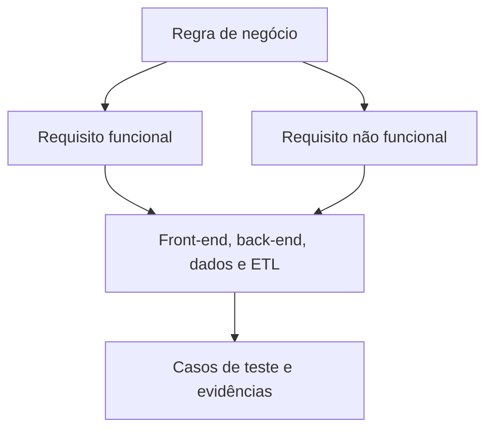

# Documentação do SISCOPI

Este repositório reúne a documentação técnica, funcional e operacional do **SISCOPI**. Seu objetivo é centralizar o conhecimento do projeto, facilitar a colaboração entre as equipes e manter a rastreabilidade entre regras de negócio, requisitos, arquitetura, implementação, dados, infraestrutura e testes.

## Objetivos da documentação

- registrar decisões e conhecimentos do projeto;
- orientar o desenvolvimento, os testes, a implantação e a operação;
- reduzir ambiguidades entre as equipes técnicas e de negócio;
- manter a rastreabilidade entre regras, requisitos, componentes e testes;
- preservar o histórico das alterações por meio do Git;
- apoiar a integração de novos integrantes à equipe.

## Estrutura do repositório

| Diretório | Conteúdo |
|---|---|
| [`01-visao-geral`](./01-visao-geral/) | Visão geral, glossário, arquitetura e decisões arquiteturais do projeto. |
| [`02-negocio`](./02-negocio/) | Regras de negócio, requisitos funcionais e não funcionais, perfis, permissões e fluxos funcionais. |
| [`03-frontend`](./03-frontend/) | Arquitetura do front-end, telas, componentes, navegação, acessibilidade, integração com APIs e testes. |
| [`04-backend`](./04-backend/) | Arquitetura do back-end, serviços, endpoints, autenticação, integrações, tratamento de erros e testes. |
| [`05-dados`](./05-dados/) | Modelo e dicionário de dados, banco de dados, migrações, processos ETL e qualidade dos dados. |
| [`06-devops`](./06-devops/) | Ambientes, infraestrutura, CI/CD, implantação, observabilidade, backup, recuperação e rollback. |
| [`07-qualidade`](./07-qualidade/) | Estratégia, planejamento, critérios de aceitação, casos de teste, evidências e rastreabilidade. |
| [`08-operacao`](./08-operacao/) | Manuais, procedimentos operacionais, solução de problemas e perguntas frequentes. |
| [`09-governanca`](./09-governanca/) | Padrões de documentação, segurança, LGPD, gestão de mudanças e histórico de versões. |
| [`templates`](./templates/) | Modelos padronizados para criação e atualização dos documentos. |

## Relação entre os documentos

As regras de negócio registram políticas, restrições e decisões do domínio. Os requisitos descrevem os comportamentos e as qualidades esperadas do sistema. As documentações técnicas detalham como esses requisitos são atendidos, enquanto os casos de teste fornecem evidências de sua verificação.



## Identificadores padronizados

| Elemento | Prefixo | Exemplo |
|---|---|---|
| Regra de negócio | `RN` | `RN-001` |
| Requisito funcional | `RF` | `RF-001` |
| Requisito não funcional | `RNF` | `RNF-001` |
| Funcionalidade de front-end | `FE` | `FE-001` |
| Componente de front-end | `COMP` | `COMP-001` |
| Endpoint | `API` | `API-001` |
| Processo ETL | `ETL` | `ETL-001` |
| Decisão arquitetural | `ADR` | `ADR-001` |
| Caso de teste | `CT` | `CT-001` |

Cada identificador deve ser único e não deve ser reutilizado, mesmo quando o item for descontinuado. Itens substituídos devem permanecer no histórico com o status correspondente.

## Como criar um documento

1. Identifique o tipo de informação que será documentada.
2. Selecione o modelo correspondente em [`templates`](./templates/).
3. Copie o arquivo para o diretório adequado.
4. Renomeie o arquivo com letras minúsculas e palavras separadas por hífen.
5. Substitua os campos entre colchetes e remova as orientações do modelo.
6. Inclua os identificadores e links dos documentos relacionados.
7. Solicite a revisão das equipes responsáveis antes da aprovação.

Exemplo de nome de arquivo:

```text
02-negocio/regras-de-negocio.md
```

## Padrões de escrita

- use linguagem clara, objetiva e verificável;
- mantenha um assunto principal por documento;
- evite duplicar informações já registradas em outro arquivo;
- use links e identificadores para relacionar documentos;
- explique siglas e termos específicos no glossário;
- utilize datas no formato `AAAA-MM-DD`;
- registre exemplos concretos quando houver condições, exceções ou cálculos;
- use tabelas de decisão para regras com múltiplas condições;
- escreva requisitos não funcionais com métricas e limites verificáveis;
- não registre senhas, tokens, chaves, dados pessoais reais ou outras informações sensíveis.

## Status dos documentos

Quando aplicável, utilize um dos seguintes estados:

| Ícone | Status | Significado |
|:---:|---|---|
|  | **Proposto** | Documento criado e ainda não validado. |
|  | **Em validação** | Conteúdo em revisão pelas áreas responsáveis. |
|  | **Aprovado** | Conteúdo validado e adotado pelo projeto. |
|  | **Implementado** | Item aprovado e disponibilizado no sistema. |
|  | **Obsoleto** | Item que não deve mais ser aplicado, mas permanece no histórico. |
|  | **Substituído** | Item sucedido por outro documento ou decisão identificada. |

> Os ícones combinam cor e símbolo para que os estados não sejam diferenciados somente pela cor.

## Fluxo de contribuição

1. Crie uma branch a partir da `main`.
2. Realize as alterações necessárias.
3. Use mensagens de commit claras e objetivas.
4. Abra um *pull request* descrevendo o motivo e o impacto das alterações.
5. Solicite a revisão dos responsáveis técnicos e, quando necessário, da área de negócio.
6. Após a aprovação, faça a integração à `main`.

Exemplos de mensagens de commit:

```text
docs: adiciona regras de classificação de cooperações
docs: atualiza contrato do endpoint de consulta
docs: registra decisão sobre armazenamento de dados
```

## Checklist para revisão

Antes de aprovar uma alteração, verifique se:

- [ ] o documento está no diretório correto;
- [ ] o modelo adequado foi utilizado;
- [ ] o título e o identificador estão corretos;
- [ ] as informações são claras e não estão duplicadas;
- [ ] condições, exceções e exemplos foram registrados quando necessários;
- [ ] os documentos relacionados estão referenciados;
- [ ] os links relativos funcionam;
- [ ] o histórico de alterações foi atualizado;
- [ ] não existem credenciais ou dados sensíveis no conteúdo.

## Fonte oficial

Os arquivos versionados neste repositório constituem a fonte oficial da documentação do projeto. Quando o conteúdo for publicado ou importado em outra plataforma, a versão correspondente e o link para o arquivo original devem ser informados.

## Acesso e confidencialidade

Este é um repositório privado. Seu conteúdo deve ser acessado e compartilhado somente por pessoas autorizadas, conforme as políticas do projeto e da organização.
